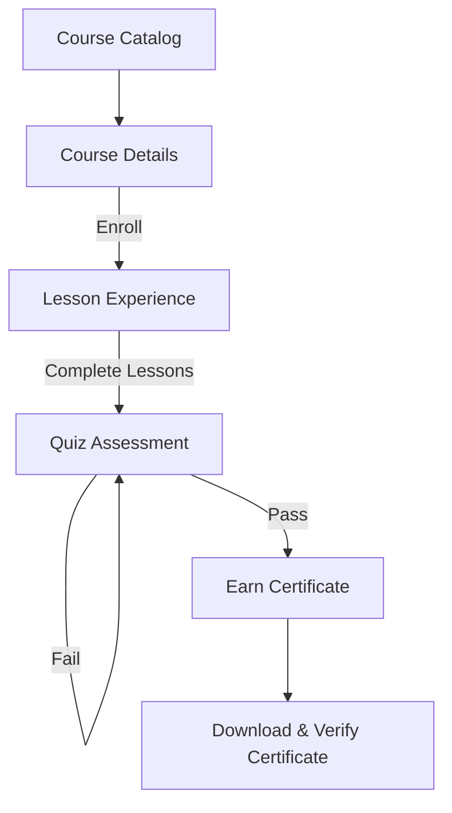

# Developer Documentation - Dawah Academy Student Experience

This document details the architectural layout, frontend state management, data flows, and analytical tracking hooks for the student-facing Dawah Academy platform on the SFU MSA Platform.

## 1. Student User Flow

The student experience consists of three core phases:
1. **Discovery**: Students browse programs in the Course Catalog, filter by difficulty, topic, or duration, and read full syllabus details.
2. **Learning**: Once enrolled, students progress through video and text lessons sequentially, with lesson files/attachments available for download.
3. **Assessment**: Upon completing all lessons, the student is eligible to take the course quiz. Scoring a passing grade issues an official completion certificate.



---

## 2. Front-End Route Structure

All student routes are child routes defined in [academy.ts](file:///d:/projects/msa%20+%20dawah/MSA%20Platform/frontend/src/router/academy.ts) under the `/academy` layout wrapper, protected by Sanctum auth token verification guards:

| Path | Route Name | Component | SEO Page Title |
| :--- | :--- | :--- | :--- |
| `/academy/dashboard` | `academy-dashboard` | `AcademyDashboardPage.vue` | Dashboard | Dawah Academy |
| `/academy/courses` | `academy-courses` | `CourseCatalogPage.vue` | Course Catalog | Dawah Academy |
| `/academy/courses/:idOrSlug` | `academy-course-details` | `CourseDetailsPage.vue` | Course Details | Dawah Academy |
| `/academy/courses/:cId/lessons/:lId` | `academy-lesson` | `LessonPage.vue` | Lesson View | Dawah Academy |
| `/academy/courses/:cId/quizzes/:qId` | `academy-quiz` | `QuizPage.vue` | Quiz | Dawah Academy |
| `/academy/courses/:cId/quizzes/:qId/results` | `academy-quiz-results` | `QuizResultsPage.vue` | Quiz Results | Dawah Academy |
| `/academy/certificates` | `academy-certificates` | `CertificatesPage.vue` | Certificates | Dawah Academy |
| `/academy/progress` | `academy-progress` | `ProgressPage.vue` | Learning Progress | Dawah Academy |

---

## 3. State Management (Pinia Stores)

To isolate side-effects and simplify state replication, the student academy features five dedicated Pinia stores:

### A. Courses Store (`useCoursesStore`)
- **Purpose**: Manages public catalog listing, search queries, active course detail fetches, and enrollment triggers.
- **Cache Policy**: Caches current course schema to prevent duplicate GET requests.

### B. Progress Store (`useProgressStore`)
- **Purpose**: Tracks lesson completion checkmarks and maps completion percentage metrics per course ID.
- **Persistence**: Synchronizes local state to LocalStorage (`academy_progress`) for offline validation and backup session recovery.

### C. Quiz Store (`useQuizStore`)
- **Purpose**: Coordinates quiz sessions, tracks timer tick-downs, captures selected choices, handles question navigation, and processes grading submissions.
- **Persistence**: Saves live, unsubmitted answers to a temporary LocalStorage cache (`quiz_session_{quizId}`) to prevent loss of progress on page refresh.

### D. Certificate Store (`useCertificateStore`)
- **Purpose**: Manages list of earned credentials and handles public verification checks by certificate code.

### E. Dashboard Store (`useDashboardStore`)
- **Purpose**: Aggregates metrics from other stores to build welcome greetings, resume learning targets, recent activity feeds, and recommended programs.

---

## 4. API Integration Services

All API communication is handled by versioned services under `src/services/academy/`, which utilize the authenticated Axios client:

- **Courses Service**: Fetches published programs and manages enrollments.
- **Lessons Service**: Posts complete progress markers to the backend.
- **Quizzes Service**: Submits answers array and returns attempt scores and grading outputs.
- **Certificates Service**: Fetches student credentials and queries validation endpoints.

### Request Payload Interface
When submitting a quiz, the payload matches the following interface:
```typescript
interface SubmittedAnswer {
  question_id: number;
  answer: string[]; // Supports multiple selections for checklists
}
```

---

## 5. Analytics Preparation Hooks

The utility [analytics.ts](file:///d:/projects/msa%20+%20dawah/MSA%20Platform/frontend/src/utils/analytics.ts) provides typed hooks for event logging:
- `trackLessonCompletion(courseId, lessonId, title)`
- `trackQuizAttempt(courseId, quizId, score, passed)`
- `trackCourseCompletion(courseId, title)`
- `trackCertificateAward(courseId, certificateCode)`
- `trackStudentEngagement(engagementType)`

---

## 6. Future Expansion Roadmap

1. **PDF Certificate Generation**: Integrate a server-side DOM-to-PDF compiler (e.g., Barryvdh DomPDF) in Laravel to render premium templates dynamically.
2. **Interactive Video Lessons**: Extend content options to include live quizzes embedded inside HLS/DASH video stream timestamps.
3. **Advanced Analytics Engine**: Connect event tracking hooks to an Elasticsearch or Mixpanel broker to monitor program engagement ratios.
